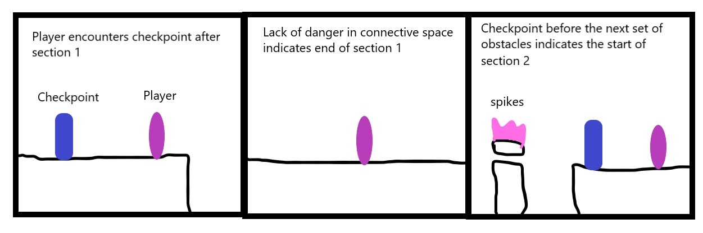
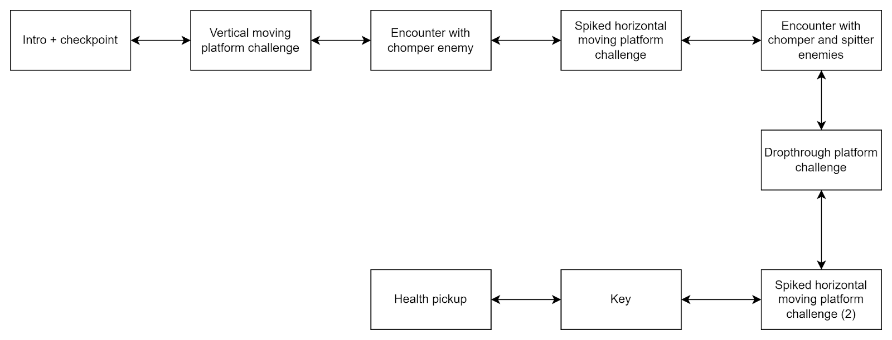

# COMP2150  - Level Design Document
### Name: Harrison Moore
### Student number: 47866403

## 1. Player Experience (~700 words)

### 1.1. Discovery
The main mechanic of the level is moving platforms, and each of the three sections explore them in different ways. However, this mechanic is fairly straightforward, and the player only needs to be taught a few things. The first section of the level is simply themed around riding the platforms, and this is the first thing that is taught to the player. Once they understand the mechanics of the moving platform, they are able to progress through the level. While the challenges become more complex, the fact that they are all themed around the moving platforms means that the player only needs to be taught this mechanic once at the beginning of the stage. The only other mechanic that is taught to the player is the passthrough platform, which, similarly to the moving platform, the player must fully understand in order to progress. Both of these mechanics are taught early within the first section of the level, and the rest of the challenges are built on these mechanics, primarily the moving platforms. For example, the platforms move in more complex patterns or are combined with spikes. However, the player's familiarity with these mechanics allows these more complex challenges to exist.

### 1.2. Drama
The level has a varying intensity curve as different types of challenges are presented to the player. The first section has a level of intensity that increases fairly consistently, as the entire section is themed around moving platforms. The connective space presented between the end of the first section and the start of the second provides a moment of relief. However, the second section introduces moving spiked platforms, and while this is still themed around the same mechanic, it has its own intensity curve as the section introduces the player to a different type of challenge. Moments of tension can be seen in scenes such as the large spiked platform, where the player must time their movements carefully, as well as with the final obstacle in the second section, where they must avoid a fast moving horizontal spiked platform. Moments of relief are provided after each section, as well as when collecting items such as the staff or gun.

### 1.3. Challenge
The level provides physical challenge and tests the player’s timing skills. The first section requires the player to traverse platforms that move both horizontally and vertically, with a later scene introducing the spitter enemy which adds the extra challenge of the projectiles. The second and third sections of the level then introduce the spiked moving platforms, and while the player interacts with these in a completely different way, it still tests them in a similar way as they have gotten used to the movement patterns of the platforms; only now, they must avoid them instead of platform on them. Backtracking is also used to create new challenges and control the difficulty curve. The scene in section 2 where the player must traverse the area while avoiding the spiked platforms requires the player to go through once to collect the staff, and then go back through the same section. However, they are of differing difficulty levels as the platforms’ movement pattern is different depending on the way the player is moving. Furthermore, the entire third section must be backtracked, as the player must traverse it once to collect a key, and then go back to the start. This allows for challenges which test the player in different ways, such as the obstacle involving the passthrough platforms in section 3. Initially, the player must drop through them at the right moment in order to avoid being hit by the spiked platforms. On the way back, however, they must time their jumps in order to jump up through the same platforms and avoid being hit by the same platforms.

### 1.4. Exploration
The first section of the level is kept intentionally linear as it is where all of the mechanics are introduced, and it ensures that the player is familiar with them before progressing to the next two sections. Once they complete section 1, however, they progress to a connective space which encourages them to explore. The player can access the exit door and the first key in this area, and can also find the entrance to the third section. However, they must first collect the staff in the second section, which allows them to break the destructible blocks and access more of the level, as well as secrets such as health pickups and the gun power up. The way in which sections 2 and 3 incorporate backtracking into their design also encourages the player to explore previously inaccessible areas.

## 2. Core Gameplay (~400 words)

### 2.1. Acid

Acid is introduced under the assumption that the player knows it is harmful, which is seen in both its visual design as well as the way it is laid out within the level. However, if the player is unfamiliar, they are able to test out the acid at the start of the first section, without losing any progress.

### 2.2. Moving Platforms

Moving platforms are the main mechanic of the level, and as such are introduced right at the start. The player is required to ride the platform to progress, and to convey this, the first section is intentionally very linear in design.

### 2.3. Spikes

Spikes are used similarly to acid, as their design and layout within the level communicates that they are dangerous. However, spikes only damage the player and take away a hit point, while the acid kills them instantly. Because of this, spikes can be used to introduce new mechanics without frustrating the player, as failure will only take away a single heart instead of sending them back to the last checkpoint.

### 2.4. Chompers

Chompers are used as an enemy in the first section, where the player has a lot of room to understand their movement and avoid them. However, being attacked presents the risk of being pushed off the ledge.

### 2.5. Passthrough Platforms

Passthrough platforms are also introduced early in the first section. Similar to the moving platforms, the player must use the passthrough platform to progress, and the scene’s linear layout forces them to engage with it.

### 2.6. Spitters

Spitters are introduced in the first section after the player becomes familiar with the moving platforms, and their projectiles are used to create a new layer of challenge. The player must avoid the projectiles without falling off the platform. Since the player does not have access to any weapons at this point, the spitter is concealed within a wall, where only its projectiles pose a threat.

### 2.7. Health Pickups

Health pickups are introduced about halfway through the first section, which is far enough into the level to where the average player will have likely taken damage. It is positioned in such a way that it is visible but clearly out of the way and not part of the main level. The health pickup is fairly easy to collect, with the challenge coming from falling back down without landing on the spikes or an enemy. Collecting the pickup will replenish one heart (assuming the player has taken damage), and it encourages them to look for more of them in the rest of the level.

### 2.8. Checkpoints

Checkpoints are also introduced with the assumption that the player understands how they work, but the design of the level still allows the player to learn their mechanics if they are unfamiliar. The first checkpoint is introduced after the first section, in the connective space of the ‘hub area’. The lack of enemies and obstacles within this area leads the player to understand that the checkpoint marks the end of the first section, with the second checkpoint being the start of the second section.

### 2.9. Keys

Keys are introduced directly after the first section, with the exit door being visible underneath the first checkpoint. The player can access this room from a passthrough platform, where they can also collect the first key. Once collected, the key is visible at the top right corner of the UI. From this, the player can infer that they must collect two more keys to unlock the exit door.

### 2.10. Weapon Pickup (Gun)

The gun is an optional collectible hidden in the second section of the level. While the staff is required to break through certain blocks, the gun is not required and only helps the player to defeat some enemies in the third section. The player passes by a destructible block near the start of the section, and once they collect the staff, they can backtrack in order to access it.

### 2.11. Weapon Pickup (Staff)

The staff is used by the player to break certain blocks which either hide collectibles or allow them to progress. Once the player collects the staff in section 2, they can use it to break the block to their left and collect a health point. They then must backtrack through the level to access previously unreachable areas, and eventually they must use the staff to unlock section 3.

## 3. Spatiotemporal Design
 
### 3.1. Molecule Diagram

### 3.2. Level Map – Section 1

### 3.3.	Level Map – Section 2

### 3.4.	Level Map – Section 3

## 4. Iterative Design (~400 words)
Iterative design was used in the process of creating and testing new ideas. Moving platforms seemed like the most versatile mechanic available, which is why they were chosen to be the focus of the level. Before I even began work in Unity, I began sketching ideas for challenges in Microsoft Paint. One of these ideas was to have a vertically moving platform which dips in and out of lava, requiring the player to time their jumps onto the platform. This challenge is seen twice in the first section of the level and was fairly easy to create in Unity, though spikes were used instead of lava or acid. Another idea common in many platformers was to have stationery platforms that fall when the player stands on them; however, there was no in-built setting in the inspector that would allow these to exist, and while they likely could have been created fairly easily by modifying them in Unity, I decided to focus on other ideas. Another reason I chose to use moving platforms as the level’s primary mechanic was because of the potential in combining it with other mechanics, specifically spikes. This was achieved through the use of a fixed 2d joint, and it allowed me to create most of the challenges in sections 2 and 3. One of my ideas was to have these platforms move in circles, and while this was not directly possible in the inspector, the option to add nodes to a platform allowed me to create something similar. Another idea was to have a wide spiked platform which moves up and down fairly quickly, requiring the player to have to time their jumps to not get damaged. Iterative design was very helpful in the design process as it allowed me to take my own ideas and adapt them to work within Unity’s engine.

## Generative AI Use Acknowledgement
